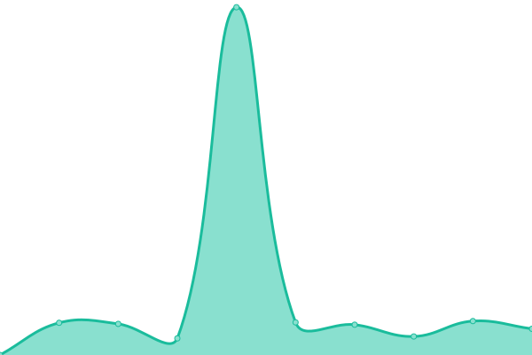

# [📈 Live Status](https://tecnologia-hispana.github.io/monitoreo-web): <!--live status--> **🟩 All systems operational**

This repository contains the open-source uptime monitor and status page for [tecnologia-hispana](https://tecnologia-hispana.github.io/monitoreo-web), powered by [Upptime](https://github.com/upptime/upptime).

With [Upptime](https://upptime.js.org), you can get your own unlimited and free uptime monitor and status page, powered entirely by a GitHub repository. We use [Issues](https://github.com/tecnologia-hispana/monitoreo-web/issues) as incident reports, [Actions](https://github.com/tecnologia-hispana/monitoreo-web/actions) as uptime monitors, and [Pages](https://tecnologia-hispana.github.io/monitoreo-web) for the status page.

<!--start: status pages-->
<!-- This summary is generated by Upptime (https://github.com/upptime/upptime) -->
<!-- Do not edit this manually, your changes will be overwritten -->
<!-- prettier-ignore -->
| URL | Status | History | Response Time | Uptime |
| --- | ------ | ------- | ------------- | ------ |
|  [hispana.com.ve](https://www.hispana.com.ve) | 🟩 Up | [hispana-com-ve.yml](https://github.com/tecnologia-hispana/monitoreo-web/commits/HEAD/history/hispana-com-ve.yml) | 

 4042ms
     
 | 

<a href="https://tecnologia-hispana.github.io/monitoreo-web/history/hispana-com-ve">100.00%</a>
    

|  [Portal Intermediaros](http://online.hispana.com.ve:8282/ords/ws_bleico/r/intermediarios/login) | 🟩 Up | [portal-intermediaros.yml](https://github.com/tecnologia-hispana/monitoreo-web/commits/HEAD/history/portal-intermediaros.yml) | 

 1124ms
     
 | 

<a href="https://tecnologia-hispana.github.io/monitoreo-web/history/portal-intermediaros">97.79%</a>
    

|  [Cotizador Autos](http://online.hispana.com.ve:8282/ords/ws_bleico/r/cotizador-publico-de-auto/home) | 🟩 Up | [cotizador-autos.yml](https://github.com/tecnologia-hispana/monitoreo-web/commits/HEAD/history/cotizador-autos.yml) | 

 487ms
     
 | 

<a href="https://tecnologia-hispana.github.io/monitoreo-web/history/cotizador-autos">97.89%</a>
    

|  [Cotizador Salud](http://online.hispana.com.ve:8282/ords/ws_bleico/r/cotizador-publico-de-salud/home) | 🟩 Up | [cotizador-salud.yml](https://github.com/tecnologia-hispana/monitoreo-web/commits/HEAD/history/cotizador-salud.yml) | 

 473ms
     
 | 

<a href="https://tecnologia-hispana.github.io/monitoreo-web/history/cotizador-salud">97.90%</a>
    

<!--end: status pages-->

[**Visit our status website →**](https://tecnologia-hispana.github.io/monitoreo-web)

## 📄 License

- Powered by: [Upptime](https://github.com/upptime/upptime)
- Code: [MIT](./LICENSE) © [tecnologia-hispana](https://tecnologia-hispana.github.io/monitoreo-web)
- Data in the `./history` directory: [Open Database License](https://opendatacommons.org/licenses/odbl/1-0/)
